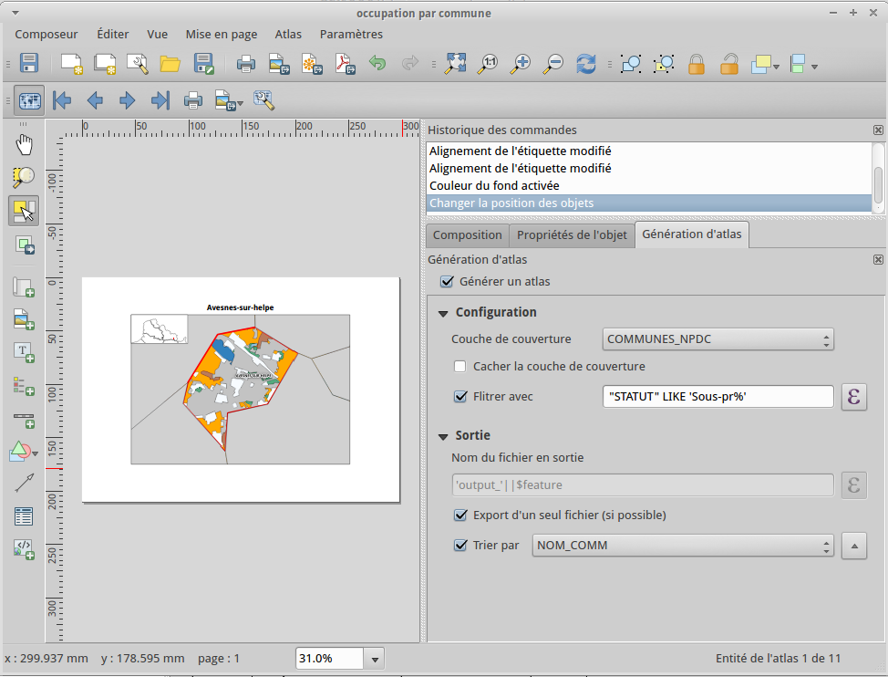

Génération d'un atlas
====================

L'atlas permet de générer automatiquement et massivement des cartes depuis un modèle de composition.

Objectif
--------

- créer une carte d'occupation des sols pour chacune des sous-préfectures du Pas-de-Calais.
- générer un atlas

Création du modèle de composition
---------------------------------

Allez dans le menu *Projet --> Nouveau composeur d'impression*.

créer la carte principale
^^^^^^^^^^^^^^^^^^^^^^^^^^^^

Allez dans le menu *Mise en page --> Ajouter une carte* puis tracez un rectangle sur le canevas en maintenant le clic gauche appuyé.

Dans la légende du projet, assurez-vous d'avoir les couches suivantes actives :

- les communes du Nord Pas-de-Calais
- les occupations du sol

Dans *propriétés de l'objet*, cochez sur *Verrouiller les couches pour cette carte* dans les propriétés principales et ajoutez un cadre. 

créer la carte d'aperçu
^^^^^^^^^^^^^^^^^^^^^^^^^^^^

Ne conservez que la couche de la région active, verrouillez les couches et zoomez sur son emprise. Dans le composeur, ajoutez une carte plus réduite que la précédence et verrouillez ses couches. Placez là dans le coin supérieur gauche de la carte principale et modifiez sa taille et on échelle pour avoir l'ensemble de la région affichée.

Ajoutez lui un cadre.

Dans le bloc Aperçu, sélectionnez la carte 0 dans la liste *Cadre d'aperçu*. Cela permet d'afficher dans la mini-carte un symbole situant l'emprise affichée dans la carte principale.

Paramétrer l'atlas
-------------------

Dans l'onglet *Génération d'atlas*, cochez la case *générer un atlas*. Sélectionner la couche des communes comme étant la couche de couverture.

Dans le bloc *Configuration*, filtrer avec l'expression  *"STATUT" LIKE 'Sous-préfecture'*. Cela permet de limiter la production de l'atlas aux communes répondant à ce critère. Il aurait été possible de filtrer sur la population, la surface, etc.

Dans le bloc *Sortie, cochez la case *Trier par* et sélectionnez NOM_COMM pour que les cartes produites le soient dans l'ordre alphabétique des noms de commune.

Sélectionnez la carte 0 puis dans ses propriétés, cochez la case des paramètres contrôlés par l'atlas et définissez une marge autour des entités de 20% afin d'avoir les alentours immédiats des communes.

Dans le bloc *Sortie*, la case *Export d'un seul fichier*. Cela permet d'obtenir un seul PDF contenant une page par carte produite. Cependant le fait d'utiliser les modes de fusion ne permet d'utiliser cette sortie de type vecteur (SVG ou PDF) via les exports directs. Pour cela il faut soit exporter en tant que fichier image (p. ex. jpeg) ou bien utiliser une imprimante virtuelle pour obtenir un PDF (PDFCreator ou Adobe PDF sous Windows).

Paramètres supplémentaires
--------------------------

mise en évidence
^^^^^^^^^^^^^^^^^

Créez une nouvelle règle pour la couche COMMUNES_NPDC, ajoutez dans le champ *Filtre* le code *$id = $atlasfeatureid* et changez le type de contours. Cette manoeuvre à pour but d'afficher de manière différente la commune concernée par chacune des pages de l'atlas afin de mieux la distinguer de ses voisines.

masquer les étiquettes inutiles
^^^^^^^^^^^^^^^^^^^^^^^^^^^^^^^

Dans la section *Rendu* de l'étiquetage de la couche, cliquez sur 

Ajout de décorations
--------------------

ajouter un titre
^^^^^^^^^^^^^^^^^

Allez dans *Mise en page --> Ajouter une étiquette* et placez-là sur le canevas. Dans les propriétés principales de l'objet, cliquez sur le bouton *Insérer une expression* et sélectionnez la colonne NOM_COMM dans les valeurs.

ajouter une légende
^^^^^^^^^^^^^^^^^^^^

Activez la couche d'occupation des sols et allez dans *Mise en page --> Ajouter une légende*. Assurez-vous que les propriétés principales indiquent que la légende est en rapport avec la carte 0;

ajouter le nombre de page
^^^^^^^^^^^^^^^^^^^^^^^^^^^^

Ajoutez une nouvelle étiquette avec l'expression *[% $page %] / [% $numpages %]*.

