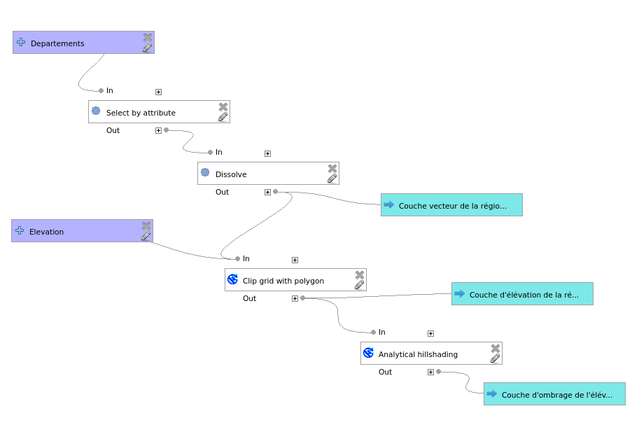
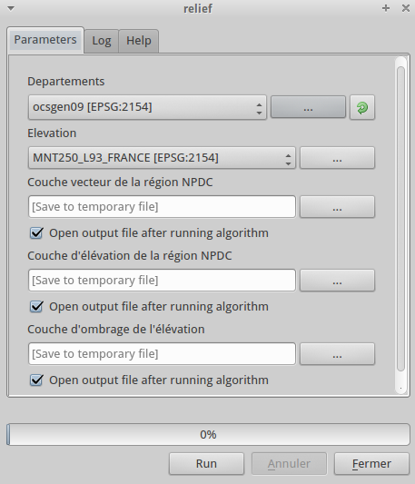
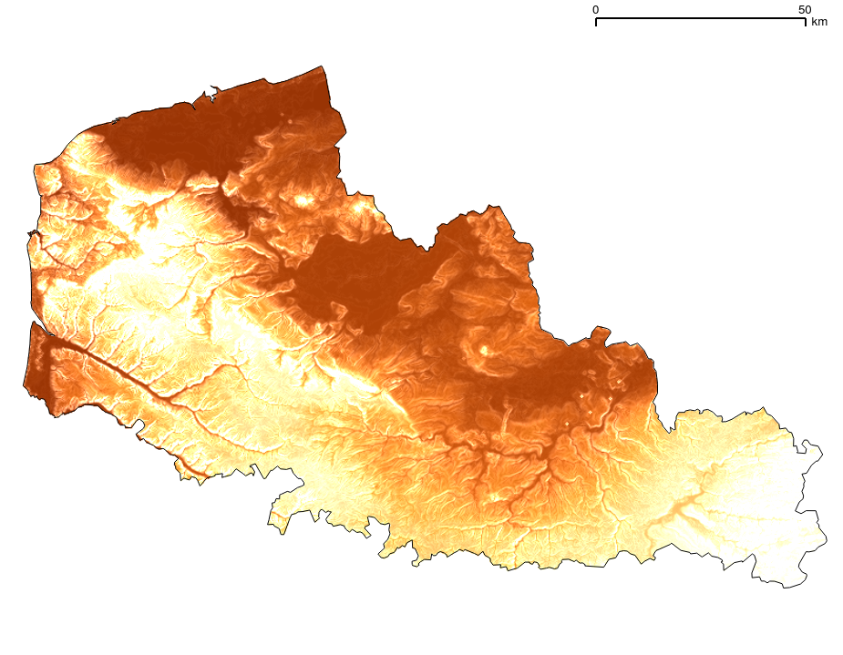

Excercice 1 : le relief du Nord-Pas-de-Calais
---------------------------------------------

Nous allons créer une représentation du relief de la région du Nord-Pas-de-Calais en utilisant les jeux de données fournis qui se situent dans le répertoire *./qgis_master_class/donnees*. Cet excercice va nous permettre de travailler avec des données vecteurs et raster, le but est d'obtenir un modèle numérique de terrain limité à la région.

Commençons par ouvrir le projet *atelier_qgis.qgs* (*./qgis_master_class/projets*) puis ouvrez le modeleur via le  menu *Traitement --> Modeleur graphique*.

Une nouvelle fenêtre s'ouvre, saisissez un nom pour identifier le modèle (ex: relief) et un nom de groupe (p. ex. *Analyses FOSS4G*). Ces noms n'ont pas d'importance dans cet excercice mais permettent de grouper différents modèles dans un même groupe qui est apparent dans la boîte à outil de Sextante.

Importer des données vecteurs
^^^^^^^^^^^^^^^^^^^^^^^^^^^^^^

Dans la liste du panneau *Entrées* qui se situe à gauche de la fenêtre, double-cliquez sur *Vector layer*.

Définissez les paramètres suivants :

- *Parameter Name* : Departements
- *Shape Type* : Polygon
- *Required* : Yes

Sélectionner la région
^^^^^^^^^^^^^^^^^^^^^^^^^^^^^^

Déplacez-vous dans l'onglet *Algorithmes*, recherchez le module *Select by attributes*.

- *Input Layer* : Departements
- *Selection attribute* : CODE_REG
- *Comparison* : ==
- *Value* : 31

Ce traitement va parcourir la table des départements pour ne sélectionner que ceux ayant le code de région désiré.

Puis le traitement *Dissolve*.

- *Input Layer* :  Output from algorithm 0
- *Dissolve all* : Yes
- *Unique ID field* : 31
- *Dissolved <OutputVector>* : Couche vecteur de la région NPDC

Ce traitement récupére les départements sélectionnées et va les fusionner afin d'obtenir une seule géométrie.

Importer des données raster
^^^^^^^^^^^^^^^^^^^^^^^^^^^^^^

Dans l'onglet Entrées, double-cliquez sur *Raster layer*.

- *Parameter Name* : Elevation
- *Required* : Yes

Découper le raster
^^^^^^^^^^^^^^^^^^^

Sélectionnez le traitement *SAGA Clip grid with polygons*.

- *Input* : BDALTI
- *Polygon* : Dissolved from algorithm 1 (Dissolve)
- *Output* : Couche d'élévation de la région NPDC

Ce traitement va utiliser la géométrie de la région comme cadre de découpage de la couche raster.

Ajouter un ombrage
^^^^^^^^^^^^^^^^^^^

Sélectionnez le traitement *Analytical Hillshading*.

- *elevation* : Output from algorithm 2
- *Shading method* : [2] Combined Shading
- *exageration* : 4
- *OutputRaster* : Couche d'ombrage de l'élévation

Ce traitement va utiliser le raster découpé pour créer une couche d'ombrage de relief.

Obtenir les résultats
^^^^^^^^^^^^^^^^^^^^^

Cliquez maintenant sur le bouton *Exécuter*, une nouvelle fenêtre s'ouvre vous demandant de sélectionner les données sur lesquelles s'appuieront les traitements :

#. la couche contenant les limites de départements dans *./donnees/vecteur*
#. la couche contenant les données altimétriques dans *./donnees/raster*

Les 3 champs qui suivent concernent les résultats produits par les différents traitements, vous avez la possibilité de :

- les enregistrer dans un fichier
- de ne les garder que temporairement. 

Cochez les cases *Open output file* pour importer automatiquement le résultat dans votre projet courant.

Enregistrez votre modèle.

Cliquez sur OK pour lancer l'opération. Voilà, vous venez d'obtenir vos résultats en ayant utilisé deux logiciels autre que QGIS (GDAL et SAGA) de manière transparente et reproductible.

Un modèle correct est disponibles dans le répertoire *./donnees/model*.

Excercices complémentaires
^^^^^^^^^^^^^^^^^^^^^^^^^^

Vous pouvez ajouter les traitements suivants au modèle :

- *Contour lines from grid* pour obtenir des courbes altimétriques
- *Watershed basins* pour obtenir les bassins versants
- *r.slope.aspect* ou *Slope, aspect, curvature* pour obtenir des cartes de pente ou d'aspect

