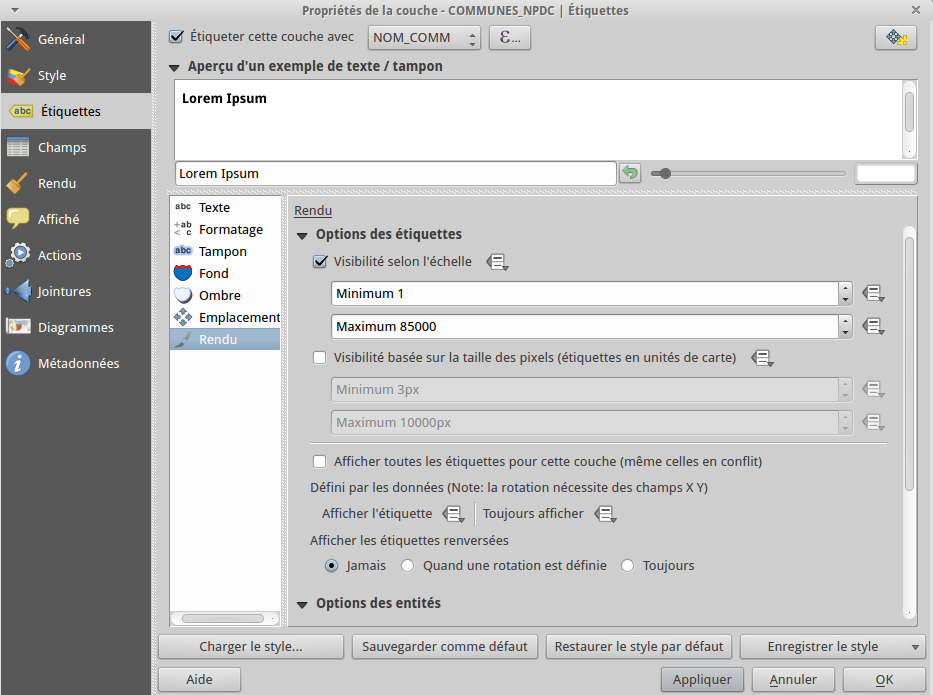
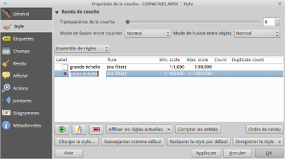

La symbologie
================================

Objectif
--------------

- classifier un raster
- utiliser des motifs
- utiliser les modes de fusion

Styles rasters
-----------------------------

Coloriser le MNT
^^^^^^^^^^^^^^^^

Allez dans les propriétés de la couche de relief puis dans le panneau de style.

Dans la section nommée *Rendu par bande*, sélectionnez le type de rendu *Pseudo-couleur à bande unique*. 

Dans le bloc *Précision*, choisissez *Réelle* puis cliquez sur le bouton *Charger*. Cela permet de s'assurer que les couleurs de classe se basent sur les véritables valeurs d'élévation de la couche plutôt que sur une estimation plus rapide mais moins précise.

Sélectionnez une palette de couleurs vous convenant puis cliquez sur le bouton *Classer*.

Appliquer les modifications pour visualiser le résultat.

Intégrer l'ombrage
^^^^^^^^^^^^^^^^^^^

Allez dans les propriétés de la couche d'ombrage puis dans le panneau de style

Dans le bloc *Rendu des couleurs*, sélectionnez le mode de fusion *Addition*. Les modes de fusions permettent de définir la manière dont une couche va s'intégrer avec celles situées en-dessous d'elles, la transparence classique ayant le défaut de faire pâlir les couleurs du relief.

.. note::
    **Ré-échantillonner pour le meilleur**
    
    QGIS permet de sélectionner les algorythmes d'interpolation de ré-échantillonnage des raster utilisés lorsque l'utilisateur zoome en avant ou en arrière, ces nouveaux modes permettent de conserver des contours nets ou de lisser les paquets de pixels. Attention, un mode tel que *cubic* améliore beaucoup l'affichage mais demande plus de ressources à votre machine.

Styles vecteurs
----------------

Le panneau vecteur est maintenant organisé en un arbre hiérarchisé, chaque niveau permettant de paramétrer des détails différents.

Le département
^^^^^^^^^^^^^^^

Allez dans les propriétés de la couche puis dans le panneau de style. Sélectionnez *Remplissage simple* et dans la liste de style de remplissage, choisissez *Pas de brosse* pour que l'intérieur du polygone soit vide. Indiquez une largeur de bordure de 0,5.

Les communes
^^^^^^^^^^^^

Utilisez la couche des communes du Pas-de-Calais (*COMMUNES_NPDC)*, allez dans les *Propriétés de la couche --> Etiquette*. Cochez la case *Etiqueter cette couche avec* puis sélectionner *NOM_COMM* dans la liste.

Activez l'affichage des tampons et des ombres en cochant les cases des panneaux correspondants.

Dans le panneau *Rendu*, activez la visibilité selon l'échelle avec un maximum de 85.000.

Maintenant déplacez-vous dans l'onglet *Style* et choisissez dans la liste le mode *Ensemble de règle*. Ce mode permet de définir des règles de symbologie de manière à avoir plusieurs représentations graphiques adaptées aux différentes échelles sans multiplier les couches. Utilisez le symbole plus vert situé en bas de la fenêtre pour ajouter un règle.gra,n

 Nous allons ici simplement définir deux règles basées sur l'échelle de visualisation :

- un contour à grande échelle : apparent entre le 1.000 et le 99.999e sans motif de fond
- un contour à petite échelle : apparent entre le 100.000e et le 1.000.000e avec un remplissage de centroïde

Occupation des sols
-------------------

Importez la couche *ocsgen09* depuis *./donnees/vecteurs/occupation_sol* et définissez le mode de rendu comme *Catégorisé*.  Sélectionnez la colonne *THEME09* et cliquez sur le bouton *Classer*.

Nous allons utiliser des symboles et des textures SVG et pour ce faire nous devons indiquer à QGIS dans quel répertoire ils se situent. Ouvrez le menu *Préférences --> Options --> Système* et dans le bloc *Chemins SVG*, ajoutez le répertoire *./donnees/textures*.

Double-cliquez sur la classe des terres cultivées, cliquez sur l'icône **+** et choisissez *Remplissage SVG* comme *Type de symbole*. DAns le cadre d'aperçus, sélectionnez le symbole *cereale*. Adaptez la taille de la largeur de texture.

Double-cliquez sur la classe des zones urbaines, faites la même manipulation et sélectionnez la texture béton.

..	figure:: ./fig/motif_symbole_resultat.png
	:align: center
	:scale: 60%
	
Nous allons définir deux modes de fusion :

- *layer blending mode* avec *Multiplier* pour définir la transparence de cette couche avec les autres couches du projet
- *feature blending mode* avec *Lumière douce* pour définir la transparence entre les objets de la couche

Dans l'onglet *Général*, activez la visibilité dépendante de l'échelle et définissez un seuil minimal au 85.000e.
